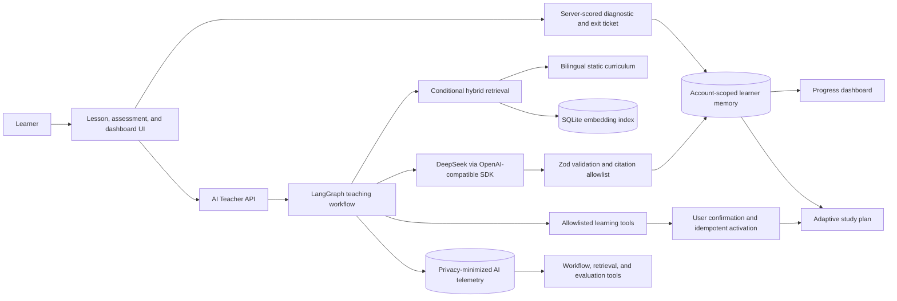

# AI Learning Platform

[English](README.md) | [简体中文](README.zh-CN.md)

A learning-centric AI education platform that combines reviewed curriculum,
LangGraph orchestration, hybrid RAG, formative assessment, and evidence-based
learner memory.

> **Portfolio status:** the application and repository checks are verified
> locally. AP Calculus AB currently covers Units 1–2 of 8 and remains a preview
> pending named subject-matter review. A hosted demo and reviewed visual
> walkthrough are the next publication artifacts.

## Why this project exists

Many AI education demos are either question generators or generic chatbots.
This project treats learning as a closed evidence loop:

```text
Knowledge graph
  -> Server-scored diagnostic
  -> Reviewed static lesson
  -> Grounded AI Teacher support
  -> Server-scored exit ticket
  -> Learner memory
  -> Evidence-aware study plan
  -> Application readiness
```

The boundary is deliberate:

- Static, structured curriculum owns the canonical teaching content.
- The AI Teacher explains, questions, corrects misconceptions, and adapts to
  the learner; it does not regenerate the course.
- The server, not the model, grades formative assessment and controls readiness.
- Learner state changes only through explicit evidence and memory-write gates.
- Retrieval, model output, cost, latency, and workflow decisions are inspectable.

## System architecture



The default LangGraph path is a bounded state machine: it classifies intent,
chooses a teaching strategy, decides whether retrieval is useful, validates the
response, and separately decides whether inferred learning signals may update
memory. Explicit planning requests enter a bounded DeepSeek tool loop; the
server injects learner and course identity, validates every call, and requires
one-time user confirmation before activating a plan. A deterministic TypeScript
runner shares the teaching policies as a fallback, while action requests fail
closed unless LangGraph is available.

See [Architecture](docs/ARCHITECTURE.md) for the request lifecycle, domain
model, trust boundaries, routes, observability, and failure behavior.

## Current scope

Repository-backed snapshot as of 2026-08-14:

| Area | Implemented scope |
| --- | --- |
| Course packs | AP Calculus AB and JavaScript Foundations |
| AP Calculus AB | Units 1–2 of 8 official units |
| AP structure | 11 platform topics, 27 concepts, and 27 lessons |
| Official alignment | Unit 1 Topics 1.1–1.16 and Unit 2 Topics 2.1–2.10 |
| Chinese AP lessons | 27 complete teaching rewrites, not sentence-level translations |
| Formative assessment | 108 bilingual items: two diagnostic and two exit-ticket items per concept |
| Visualizations | 10 selected Unit 1 concepts |
| Review state | Engineering-complete AI-authored preview; named subject-matter review still required |

The second, smaller JavaScript course demonstrates that course routing,
localization, retrieval, assessment registration, and learner memory are scoped
by `courseId` rather than hard-coded to AP Calculus.

## Engineering highlights

### 1. Bounded Agent orchestration

- LangGraph is used for observable conditional orchestration, not open-ended
  autonomous behavior.
- Lightweight turns skip retrieval; substantive questions search the active
  concept, retry at most once at course scope, then fall back to reviewed lesson
  context.
- Missing keys, provider failures, timeouts, invalid JSON, schema failures, and
  interrupted streams are surfaced instead of being replaced with fake answers.
- AI-inferred signals pass through a separate memory-write gate; audit-only and
  lightweight interactions cannot silently change readiness.
- Explicit planning requests can use four allowlisted learning tools to inspect
  state, retrieve course evidence, draft a plan, and request activation.
- Tool execution is capped at three model steps and four calls. Model-provided
  identity fields and unknown arguments are rejected by strict Zod schemas.
- Plan activation is a two-phase write with a hashed, expiring, learner-bound
  confirmation token and idempotent SQLite transaction; MCP and multi-agent
  orchestration are intentionally outside the current scope.

### 2. Evaluated hybrid RAG

- English and Chinese lesson sections become stable, source-labelled chunks.
- Hybrid retrieval combines calibrated keyword evidence (65%) with embedding
  similarity (35%); keyword remains the deterministic fallback.
- An incomplete, stale, or wrong-model embedding index is rejected rather than
  searched partially.
- The model can select only retrieved chunk ids. The backend converts only ids
  from the retrieval allowlist into citations shown to the learner.
- The checked-in 48-case suite covers bilingual queries, ranking distractors,
  two courses, and explicit no-match cases.

See [RAG and retrieval evaluation](docs/RAG_EVALUATION.md) for chunking,
retrieval policy, metric definitions, current results, and the no-reranker
decision.

### 3. Evidence-based learner state

- SQLite stores account-scoped readiness, misconceptions, learning signals,
  assessment attempts, and learning gain.
- Correct answers never reach the assessment client; the server validates and
  grades each attempt against the registered curriculum.
- Conversation evidence and diagnostics alone are capped below application
  readiness. A strong exit ticket is required to certify transfer.
- Misconceptions retain an audit history, can be repaired by stronger evidence,
  and reopen when newer evidence supports the same problem.
- The planner ranks up to three unlocked concepts using prerequisite stability,
  active misconceptions, assessment evidence, and recency.

### 4. Evaluation and observability

- Structured AI responses are validated with Zod before persistence.
- A deterministic suite checks contract, pedagogy, grounding, safety,
  localization, and workflow behavior.
- Opt-in live evaluation persists score, latency, token, cost, model, prompt,
  and release-gate metadata without storing raw learner/assistant messages in
  the telemetry table.
- Prompt injection, privacy canaries, false premises, bilingual behavior, and
  citation hallucination pressure are explicit evaluation cases.
- Human calibration remains `insufficient_samples` until three distinct live
  runs have complete reviews, preventing a premature calibration claim.
- CI exports privacy-safe JSON and Markdown governance artifacts without
  calling the model.

## Verified evidence

Latest local repository verification:

| Check | Result |
| --- | --- |
| Automated tests | 119 / 119 passed |
| Agent routing and safety | 20 / 20 bilingual routing cases; scope injection, call budgets, expiry, and idempotency covered |
| Live Tool Calling smoke | `deepseek-v4-pro` returned one declared tool call; full authenticated UI E2E is not yet claimed |
| TypeScript | `npx tsc --noEmit` passed |
| ESLint | `npm run lint` passed |
| Production dependency audit | 0 high/critical vulnerabilities |
| Production build | Passed; 89 static pages generated |

Latest environment-backed retrieval snapshot:

| Retrieval evidence | Result |
| --- | --- |
| Curriculum chunks | 506 |
| Embedding coverage | 506 / 506 current; 0 missing, stale, or orphaned |
| Evaluation set | 48 cases: 45 positive and 3 explicit no-match cases |
| Hybrid release gate | 48 / 48 passed |
| Hybrid Top-1 | 84.44% |
| Hybrid Top-3 | 100% |
| Hybrid Recall@8 | 100% |
| Hybrid no-match accuracy | 100% |
| Keyword Top-1 baseline | 77.78% |
| Embedding-only Top-1 | 71.11% |

Top-1 and Top-3 are **retrieval hit rates**, not generated-answer accuracy.
They measure whether the expected curriculum evidence is ranked first or within
the first three results for the 45 positive cases. No-match accuracy is reported
separately for the three questions that should retrieve nothing.

Embedding results are environment-backed and must be rebuilt and re-evaluated
after curriculum, chunking, model, threshold, or fusion-weight changes.

## Product experience

- Chinese-default bilingual interface with a shared language preference.
- Course -> unit -> concept navigation backed by a dependency graph.
- Schema-complete lessons with progressive explanations, worked examples,
  misconception checks, reflection, and application-readiness tasks.
- Sticky desktop and mobile-drawer AI Teacher with section and text-selection
  context actions.
- Progressive NDJSON model streaming with visible stages, a three-minute
  timeout, and user-controlled cancellation.
- Server-scored diagnostic and exit-ticket flow with persisted learning gain.
- Course and unit dashboards plus an evidence-aware next-session plan.
- Developer Mode for workflow traces, RAG inspection, retrieval evaluation,
  live-model evaluation, AI-run telemetry, and governance reports.

## Try the core flow

1. Open `/learn` and select **AP Calculus AB**.
2. Choose Unit 1 or Unit 2 and open a concept lesson.
3. Sign in and complete the diagnostic.
4. Read a lesson section, then use **Ask about this** or select lesson text.
5. Ask a misconception-style question, for example:

   ```text
   I think the limit is always the same as the function value.
   ```

6. Complete the exit ticket and inspect the learning-gain/readiness update.
7. Open `/dashboard` and `/plan` to see how evidence changes recommendations.
8. Enable Developer Mode and inspect the run in
   `/dashboard/workflow-inspector`.

## Tech stack

- Next.js 16 App Router, React 19, TypeScript, and Tailwind CSS 4
- LangGraph.js with a deterministic TypeScript fallback runner
- DeepSeek through the OpenAI-compatible JavaScript SDK
- Zod for input, output, and evaluation contracts
- SQLite for authentication, learner memory, AI telemetry, evaluations, and
  the local embedding index
- Auth.js credentials sessions with bcrypt password hashing
- Node test runner, ESLint, TypeScript, GitHub Actions, and Docker Compose

## Quick start

Prerequisites: Node.js, npm, and a DeepSeek API key for live AI Teacher calls.
The deterministic curriculum and workflow tests do not call the model.

```powershell
git clone https://github.com/yemingc/ai-learning-platform.git
cd ai-learning-platform
npm install
Copy-Item .env.example .env.local
# Add DEEPSEEK_API_KEY and replace AUTH_SECRET in .env.local
npm run dev
```

Open `http://localhost:3000`.

Core verification commands:

```powershell
npm test
npx tsc --noEmit
npm run lint
npm run audit:prod
npm run build
```

Hybrid or embedding retrieval additionally requires an embedding-compatible
provider and a running application:

```powershell
npm run embeddings:build
npm run test:rag
```

For every environment variable, Docker deployment, health checks, demo seeding,
auth regression, backups, and governance exports, see
[Operations and deployment](docs/OPERATIONS.md).

## Documentation

| Document | Purpose |
| --- | --- |
| [Architecture](docs/ARCHITECTURE.md) | System boundaries, workflows, domain model, routes, failure handling, and observability |
| [RAG and retrieval evaluation](docs/RAG_EVALUATION.md) | Chunking, embedding index, hybrid policy, evaluation metrics, and tradeoffs |
| [Operations and deployment](docs/OPERATIONS.md) | Environment, local setup, verification, Docker, demo data, health, and backup |
| [AP Calculus official alignment](docs/AP_CALCULUS_OFFICIAL_ALIGNMENT.md) | Unit 1–2 mapping to the official framework and review status |
| [Curriculum Pack Generation Guide](docs/CURRICULUM_PACK_GUIDE.md) | Course-pack contract, localization, assessment, and integration rules |
| [Course brief template](docs/CURRICULUM_PACK_BRIEF.template.yaml) | Reusable whole-course planning brief |

## Current boundaries

This is a locally verified portfolio MVP, not a production learning service.
It intentionally does not claim:

- AP Calculus AB Units 3–8
- named subject-matter approval for the AI-authored Units 1–2 preview
- high-stakes grading or a complete practice question bank
- calibrated automated teaching scores before three reviewed live runs
- email ownership verification, OAuth, or production learner onboarding
- horizontally scaled or serverless SQLite deployment
- production-grade analytics, distributed tracing, or multi-instance recovery

The current implementation uses no reranker and no external vector database.
The evaluated hybrid retriever already meets the checked-in release gate; those
components should be added only when a larger corpus or real failure analysis
justifies their operational cost.

## Next publication increment

The next useful increment is evidence packaging, not another AI feature:

1. Deploy the verified standalone image to a single-instance container host.
2. Rebuild and evaluate the embedding index in that environment.
3. Collect at least three complete human-reviewed live evaluation runs.
4. Add reviewed screenshots or a 60–90 second walkthrough covering the learner
   flow, Workflow Inspector, retrieval evaluation, and dashboard evidence.
5. Record named subject-matter review before changing AP Units 1–2 from
   `preview`.

After those artifacts exist, the repository is ready to become public and be
used as the primary implementation evidence in applications and interviews.
