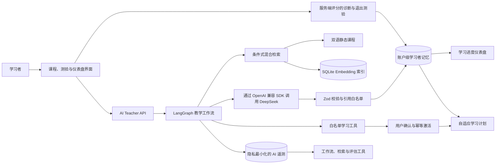

# AI Learning Platform

[English](README.md) | [简体中文](README.zh-CN.md)

一个以学习效果为中心的 AI 教育平台，结合经过审阅的课程内容、LangGraph 编排、
混合 RAG、形成性评估和基于证据的学习者记忆。

> **作品集状态：** 应用与仓库检查已在本地通过。AP Calculus AB 目前覆盖 8 个
> 单元中的第 1–2 单元，仍属于等待具名学科专家审阅的预览版本。下一步发布材料是
> 可在线访问的演示，以及经过审核的可视化演示视频。

## 为什么做这个项目

很多 AI 教育 Demo 本质上只是题目生成器或通用聊天机器人。本项目将学习设计成一个
闭环证据流程：

```text
知识图谱
  -> 服务端评分的诊断测验
  -> 经过审阅的静态课程
  -> 基于课程证据的 AI Teacher 辅导
  -> 服务端评分的退出测验
  -> 学习者记忆
  -> 基于证据的学习计划
  -> 应用能力准备度
```

系统边界是有意设计的：

- 结构化静态课程是标准教学内容的唯一来源。
- AI Teacher 负责解释、追问、纠正误区和适配学习者，但不重新生成课程。
- 形成性评估与准备度由服务端控制和评分，而不是交给模型判断。
- 只有明确的学习证据通过记忆写入门控后，学习者状态才会变化。
- 检索、模型输出、成本、延迟和工作流决策均可检查。

## 系统架构



默认 LangGraph 路径是一个有边界的状态机：它识别意图、选择教学策略、判断检索是否
有用、校验输出，并单独判断模型推断出的学习信号是否可以写入记忆。显式的学习规划
请求会进入有界的 DeepSeek 工具循环；learnerId 与 courseId 由服务端注入，每次调用都
经过参数校验，激活计划前必须使用一次性令牌获得用户确认。确定性的 TypeScript
执行器与教学路径共享相同策略；行动请求在 LangGraph 不可用时会安全失败。

完整请求生命周期、领域模型、信任边界、路由、可观测性和失败行为参见
[架构文档](docs/ARCHITECTURE.md)。

## 当前范围

基于仓库的快照日期为 2026-08-14：

| 范围 | 已实现内容 |
| --- | --- |
| 课程包 | AP Calculus AB 与 JavaScript Foundations |
| AP Calculus AB | 官方 8 个单元中的第 1–2 单元 |
| AP 课程结构 | 11 个平台主题、27 个概念和 27 节课 |
| 官方框架对齐 | Unit 1 Topics 1.1–1.16 与 Unit 2 Topics 2.1–2.10 |
| AP 中文课程 | 27 篇完整的中文教学重写，不是逐句翻译 |
| 形成性评估 | 108 道双语题；每个概念包含 2 道诊断题和 2 道退出测验题 |
| 可视化 | 覆盖 Unit 1 中选定的 10 个概念 |
| 审阅状态 | 工程实现完成的 AI 生成预览；仍需具名学科专家审阅 |

第二个规模较小的 JavaScript 课程用于证明：课程路由、本地化、检索、测验注册和
学习者记忆都以 `courseId` 为作用域，并非硬编码到 AP Calculus。

## 工程亮点

### 1. 有边界的 Agent 编排

- LangGraph 用于可观测的条件式编排，而不是开放式自主行为。
- 轻量对话跳过检索；实质性问题先检索当前概念，最多在课程范围重试一次，最后回退到
  经过审阅的课程上下文。
- 密钥缺失、供应商故障、超时、无效 JSON、Schema 校验失败和流式响应中断都会被
  明确暴露，而不是返回伪造答案。
- AI 推断出的学习信号必须通过独立的记忆写入门控；仅审计或轻量交互不能静默改变
  准备度。
- 显式规划请求可以使用 4 个白名单学习工具：读取学习状态、检索课程证据、起草计划和
  请求激活。
- 工具循环最多执行 3 个模型步骤和 4 次工具调用；模型注入身份字段、未知字段或未知
  工具时，严格 Zod Schema 会拒绝执行。
- 计划激活采用两阶段写入：确认令牌只保存哈希、会过期且绑定学习者，SQLite 事务保证
  幂等；MCP 与多 Agent 编排仍明确不在当前范围内。

### 2. 经过评估的混合 RAG

- 英文与中文课程章节会被转换为稳定且带有来源标签的 chunk。
- 混合检索融合经过校准的关键词证据（65%）与 embedding 相似度（35%）；关键词检索
  同时作为确定性回退方案。
- 不完整、过期或模型不匹配的 embedding 索引会被整体拒绝，而不是只检索其中一部分。
- 模型只能选择已检索到的 chunk id。后端只会把检索白名单中的 id 转换为展示给
  学习者的引用。
- 仓库内的 48 条评估用例覆盖中英文问题、排序干扰项、两门课程和显式无匹配场景。

分块、检索策略、指标定义、当前结果以及暂不引入 reranker 的决策，参见
[RAG 与检索评估](docs/RAG_EVALUATION.md)。

### 3. 基于证据的学习者状态

- SQLite 保存账户级准备度、知识误区、学习信号、测验记录和学习增益。
- 正确答案不会发送到测验客户端；服务端依据已注册课程验证并评分每次作答。
- 仅有对话证据和诊断结果时，准备度上限低于应用能力要求；必须通过表现良好的退出
  测验才能证明知识迁移。
- 知识误区保留审计历史，可以被更强证据修复，也会在新证据再次支持同一问题时重新
  打开。
- 学习规划器根据先修知识稳定度、活跃误区、测验证据和时间新近性，最多推荐 3 个
  已解锁概念。

### 4. 评估与可观测性

- 结构化 AI 响应必须通过 Zod 校验后才会持久化。
- 确定性测试套件检查契约、教学法、事实依据、安全性、本地化和工作流行为。
- 可选的在线评估会保存分数、延迟、token、成本、模型、prompt 和发布门控元数据，
  但不会把学习者与 AI 的原始消息写入遥测表。
- Prompt injection、隐私 canary、错误前提、双语行为和引用幻觉压力都包含明确评估
  用例。
- 在 3 次不同的在线运行获得完整人工审核之前，人工校准状态保持为
  `insufficient_samples`，避免过早声称已完成校准。
- CI 不调用模型即可导出不含敏感信息的 JSON 与 Markdown 治理材料。

## 已验证证据

最近一次本地仓库验证：

| 检查项 | 结果 |
| --- | --- |
| 自动化测试 | 119 / 119 通过 |
| Agent 路由与安全 | 20 / 20 条双语路由用例通过；覆盖身份注入、调用预算、过期和幂等 |
| 真实 Tool Calling 冒烟 | `deepseek-v4-pro` 返回 1 个声明工具调用；尚不声称完整登录态 UI E2E 已完成 |
| TypeScript | `npx tsc --noEmit` 通过 |
| ESLint | `npm run lint` 通过 |
| 生产依赖审计 | 0 个高危或严重漏洞 |
| 生产构建 | 通过；生成 89 个静态页面 |

最近一次依赖运行环境的检索结果：

| 检索证据 | 结果 |
| --- | --- |
| 课程 chunk 数 | 506 |
| Embedding 覆盖率 | 506 / 506 为当前版本；0 个缺失、过期或孤立项 |
| 评估集 | 48 条用例：45 条正例和 3 条显式无匹配用例 |
| 混合检索发布门控 | 48 / 48 通过 |
| 混合检索 Top-1 | 84.44% |
| 混合检索 Top-3 | 100% |
| 混合检索 Recall@8 | 100% |
| 混合检索无匹配准确率 | 100% |
| 关键词 Top-1 基线 | 77.78% |
| 纯 Embedding Top-1 | 71.11% |

Top-1 与 Top-3 是**检索命中率**，不是生成答案的准确率。它们衡量 45 条正例中，
期望课程证据是否排在第 1 位或前 3 位。无匹配准确率则针对 3 条本不应检索到内容的
问题单独统计。

Embedding 结果依赖运行环境。课程、分块方式、模型、阈值或融合权重变化后，必须
重新构建索引并重新评估。

## 产品体验

- 默认中文的双语界面，并共享统一语言偏好。
- 基于依赖图的“课程 -> 单元 -> 概念”导航。
- 符合完整 Schema 的课程内容，包含渐进式讲解、示例、误区检查、反思和应用准备度
  任务。
- 桌面端固定、移动端抽屉式的 AI Teacher，支持章节上下文与选中文本提问。
- 渐进式 NDJSON 模型流响应，展示处理阶段，超时为 3 分钟，并支持用户主动取消。
- 服务端评分的诊断与退出测验流程，并持久化学习增益。
- 课程与单元仪表盘，以及基于证据的下一学习阶段计划。
- Developer Mode 提供工作流 trace、RAG 检查、检索评估、在线模型评估、AI 运行遥测
  和治理报告。

## 体验核心流程

1. 打开 `/learn`，选择 **AP Calculus AB**。
2. 选择 Unit 1 或 Unit 2，并打开一个概念课程。
3. 登录并完成诊断测验。
4. 阅读一节课程，然后点击 **Ask about this**，或选中一段课程文本进行提问。
5. 提出一个包含常见误区的问题，例如：

   ```text
   我认为极限值总是等于函数值。
   ```

6. 完成退出测验，检查学习增益与准备度如何更新。
7. 打开 `/dashboard` 和 `/plan`，观察学习证据如何改变推荐内容。
8. 启用 Developer Mode，在 `/dashboard/workflow-inspector` 中检查本次运行。

## 技术栈

- Next.js 16 App Router、React 19、TypeScript 与 Tailwind CSS 4
- LangGraph.js，以及作为回退方案的确定性 TypeScript 执行器
- 通过 OpenAI 兼容 JavaScript SDK 调用 DeepSeek
- 使用 Zod 定义输入、输出和评估契约
- SQLite 用于认证、学习者记忆、AI 遥测、评估和本地 embedding 索引
- Auth.js 凭证会话与 bcrypt 密码哈希
- Node test runner、ESLint、TypeScript、GitHub Actions 与 Docker Compose

## 快速开始

环境要求：Node.js、npm，以及用于调用在线 AI Teacher 的 DeepSeek API key。
确定性课程与工作流测试不会调用模型。

```powershell
git clone https://github.com/yemingc/ai-learning-platform.git
cd ai-learning-platform
npm install
Copy-Item .env.example .env.local
# 在 .env.local 中添加 DEEPSEEK_API_KEY，并替换 AUTH_SECRET
npm run dev
```

打开 `http://localhost:3000`。

核心验证命令：

```powershell
npm test
npx tsc --noEmit
npm run lint
npm run audit:prod
npm run build
```

混合检索或 embedding 检索还需要兼容的 embedding 服务，以及正在运行的应用：

```powershell
npm run embeddings:build
npm run test:rag
```

全部环境变量、Docker 部署、健康检查、Demo 数据初始化、认证回归测试、备份与治理材料
导出，请参阅[运维与部署文档](docs/OPERATIONS.md)。

## 文档

| 文档 | 用途 |
| --- | --- |
| [架构文档](docs/ARCHITECTURE.md) | 系统边界、工作流、领域模型、路由、失败处理和可观测性 |
| [RAG 与检索评估](docs/RAG_EVALUATION.md) | 分块、embedding 索引、混合策略、评估指标和权衡 |
| [运维与部署](docs/OPERATIONS.md) | 环境、本地配置、验证、Docker、Demo 数据、健康检查和备份 |
| [AP Calculus 官方框架对齐](docs/AP_CALCULUS_OFFICIAL_ALIGNMENT.md) | 第 1–2 单元与官方框架的映射及审阅状态 |
| [课程包生成指南](docs/CURRICULUM_PACK_GUIDE.md) | 课程包契约、本地化、测验和集成规则 |
| [课程 brief 模板](docs/CURRICULUM_PACK_BRIEF.template.yaml) | 可复用的全课程规划 brief |

## 当前边界

这是一个已在本地验证的作品集 MVP，不是生产环境学习服务。项目不会声称已经具备：

- AP Calculus AB 第 3–8 单元
- 对 AI 生成的第 1–2 单元预览内容完成具名学科专家认可
- 高风险评分能力或完整练习题库
- 在 3 次在线运行获得人工审核前，完成自动教学评分校准
- 邮箱所有权验证、OAuth 或生产环境学习者注册流程
- 横向扩展或基于无服务器架构的 SQLite 部署
- 生产级分析、分布式追踪或多实例恢复能力

当前实现没有使用 reranker，也没有使用外部向量数据库。经过评估的混合检索器已经
达到仓库内定义的发布门控；只有当课程规模扩大或真实失败分析能够证明收益时，才应
承担这些组件带来的运维成本。

## 下一步发布工作

下一步最有价值的增量是打包项目证据，而不是继续增加 AI 功能：

1. 将已验证的 standalone 镜像部署到单实例容器托管平台。
2. 在目标环境中重新构建并评估 embedding 索引。
3. 收集至少 3 次经过完整人工审核的在线评估运行。
4. 添加经过审核的截图或 60–90 秒演示视频，覆盖学习者流程、Workflow Inspector、
   检索评估和仪表盘学习证据。
5. 在将 AP 第 1–2 单元从 `preview` 改为正式状态前，记录具名学科专家审阅结果。

完成这些材料后，仓库即可转为公开，并作为求职申请与面试中的主要实现证据。
