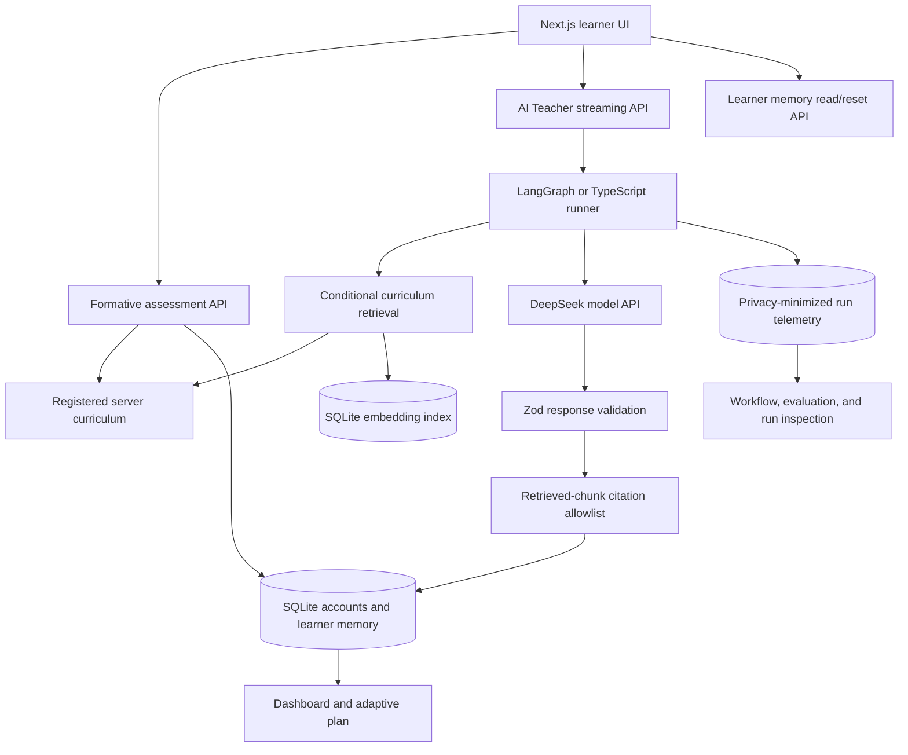

# Architecture

This document describes the architecture and trust boundaries of the AI
Learning Platform. The implementation is a portfolio-oriented, single-instance
Next.js application rather than a horizontally scaled production learning
service.

## Product thesis and system boundary

The central entity is a `Concept`, not a question. The system combines:

1. a course-owned knowledge graph;
2. server-scored diagnostic evidence;
3. structured, reviewable lesson content;
4. a bounded AI Teacher workflow;
5. server-scored exit evidence;
6. account-scoped learner memory; and
7. an evidence-aware next-learning plan.

Static curriculum owns canonical explanations and assessment contracts. AI is
used where interaction is valuable: clarifying an explanation, selecting a
teaching move, asking a guiding question, generating a fresh example, detecting
a possible misconception, and suggesting the next study action. The model does
not grade the learner or regenerate the course.

## System overview



## AI Teacher request lifecycle

```text
Student message
  -> Authenticate and validate request
  -> Build compact lesson and learner context
  -> Classify intent
  -> Select teaching strategy
  -> Decide whether curriculum retrieval is useful
      -> Lightweight turn: use reviewed lesson context
      -> Substantive turn: search active concept
          -> Accept relevant evidence
          -> Or retry once at course scope
          -> Or fall back to reviewed lesson context
  -> Stream model output
  -> Parse and validate the complete structured response
  -> Filter citations against the retrieved chunk allowlist
  -> Extract learning signals
  -> Decide whether memory may be updated
      -> Persist evidence
      -> Record audit-only interaction
      -> Or skip a lightweight/interrupted turn
  -> Return the next study action
```

LangGraph is compiled once as the default bounded state machine. A deterministic
TypeScript runner shares the same retrieval, validation, and memory policies and
is available as an orchestration fallback through:

```env
TEACHER_WORKFLOW_ENGINE=typescript
```

The fallback is not a fake-answer path. Missing API keys, provider failures,
timeouts, invalid JSON, and schema-validation failures are still surfaced to
the user.

## Context and prompt boundary

The AI Teacher receives only the context required for the current interaction:

- current course, unit, concept, and section;
- compact lesson objective, key takeaways, and active-section content;
- selected text, when the learner used a text-selection action;
- current learner message and bounded recent chat history;
- authenticated learner-memory snapshot;
- server-scored diagnostic/exit evidence and learning gain; and
- at most four approved curriculum chunks when retrieval is useful.

The prompt instructs the teacher to explain simply, ask Socratic questions,
offer alternate examples, correct misconceptions, encourage reflection, and
remain concise. It prohibits full-lesson regeneration, generic-chat behavior,
and model-led grading.

## Structured AI contract

The final response is validated with Zod before it is persisted. Its product
contract contains:

- `assistantMessage`
- `suggestedFollowUps`
- optional `detectedMisconception`
- `teachingMove`
  - `explain`
  - `ask_guiding_question`
  - `give_example`
  - `correct_misconception`
  - `reflect`
- `memorySignals`
  - `confusionLevel`
  - optional `misconceptionType`
  - `needsReview`
  - `suggestedStudyAction`
  - `confidenceDelta`
  - `evidenceNote`
- `citationChunkIds`

The model returns only citation ids. The server creates citation objects only
for ids in the retrieved chunk whitelist, preventing the model from inventing
displayed sources.

## Streaming and cancellation

The server uses progressive NDJSON streaming backed by provider token streaming.
The learner sees preparation, generation, and learning-state finalization
stages. The complete response is schema-validated before persistence.

- Calls have a three-minute timeout.
- The learner can stop generation.
- Interrupted drafts are labelled in the UI.
- Interrupted responses are excluded from later chat context and learner-memory
  updates.
- Per-learner burst and rolling daily quotas are reserved atomically before the
  model call. A rejected request returns `429` with `Retry-After`.

## Curriculum and course isolation

Each curriculum pack owns its graph, lessons, localizations, teaching profile,
assessment provider, and optional visualizations. The registry validates every
pack, and platform services resolve resources by `courseId`, preventing concept
ids or content from leaking between courses.

Current registered packs:

- AP Calculus AB: the full product preview, with Units 1–2 implemented.
- JavaScript Foundations: a small second pack proving platform reuse.

Lesson assets include stable section ids, section types, learning objectives,
prerequisite concept ids, glossary terms, retrieval tags, application tasks, and
optional visualizations. Chinese lessons are natural teaching rewrites with
course-required English academic terms retained where useful.

For course creation and extension, use the
[Curriculum Pack Generation Guide](CURRICULUM_PACK_GUIDE.md) and
[whole-course brief template](CURRICULUM_PACK_BRIEF.template.yaml).

## Formative assessment trust boundary

Every implemented AP concept has two diagnostic and two exit-ticket items.
Answer keys remain in server-only curriculum resources.

```text
GET assessment
  -> returns a minimal item DTO without correct options or explanations

POST attempt
  -> re-authenticates learner
  -> validates course, concept, item, phase, and option
  -> grades against server curriculum
  -> persists assessment evidence
  -> recomputes learning gain and readiness
```

The assessment is formative evidence, not a course grade. Deterministic
server-scored evidence outranks model-inferred confidence.

## Learner memory and adaptive planning

Learner memory is isolated by `learnerId + courseId` and stores:

- readiness score and learning status;
- diagnostic and exit-ticket attempts;
- measured learning gain;
- recent AI interactions and evidence level;
- confusion signals;
- active, repaired, and reopened misconceptions; and
- memory-signal audit history.

Conversation and diagnostic evidence alone cannot certify application
readiness. A sufficiently strong exit ticket is required. Strong exit evidence
can repair stale negative conversation signals, while a newer supported signal
can reopen a misconception.

The authenticated `/plan` route ranks up to three unlocked concepts. It uses
prerequisite stability, server-scored evidence, readiness, misconception state,
and recent review signals. Blocked downstream concepts remain visible but are
not recommended until prerequisites stabilize.

## Authentication and access boundaries

- Registration stores an email and bcrypt password hash in SQLite.
- Auth.js credentials login creates a JWT session with `session.user.id`.
- The current preview does not verify email ownership.
- Learners cannot directly write arbitrary memory patches; trusted assessment
  and AI Teacher services perform writes.
- Student login and Developer Mode are separate access decisions.
- Shared or production demos should protect Developer Mode with
  `DEVELOPER_MODE_PASSWORD`.
- Embedding-index builds and evaluation-report exports use separate optional
  bearer secrets with no shared authority.

## Evaluation and observability

### Workflow Inspector

`/dashboard/workflow-inspector` exposes the selected concept, student message,
assistant preview, intent, teaching strategy, learning signals, memory patch,
next action, node trace, workflow engine, model, prompt version, token usage,
first-token latency, and total model latency for captured runs.

### Persisted run telemetry

`/developer/ai-runs` reports 24-hour volume, success rate, latency, token usage,
retrieval/fallback behavior, model and prompt versions, evaluation summaries,
cost estimates, release-gate decisions, and hashed learner labels.

Raw learner and assistant messages are not stored in the telemetry table.
Retention defaults to 90 days and is configurable with
`AI_RUN_RETENTION_DAYS`.

### Evaluation governance

The deterministic and opt-in live suites report six dimensions: `contract`,
`pedagogy`, `grounding`, `safety`, `localization`, and `workflow`. Empty
dimensions are displayed as not run rather than receiving a perfect score.

Live summaries can be compared with the latest approved prompt/model baseline.
The versioned gate checks absolute quality, quality regression, token evidence,
known pricing, and estimated cost. Input tokens are conservatively priced as
cache misses because current provider telemetry does not distinguish cache hits.
The current `deepseek-official-usd-2026-07-11` pricing snapshot is sourced from
the [official DeepSeek pricing documentation](https://api-docs.deepseek.com/quick_start/pricing),
so historical gate decisions retain the policy and price version used at the
time instead of silently adopting a later price.

Human review covers pedagogy, grounding, safety, and localization. Calibration
reports mean absolute error, signed bias, and agreement within 20 points, but
remains `insufficient_samples` until three distinct runs have complete reviews.

The privacy-safe `ai-evaluation-governance-report-v1` export excludes messages,
learner ids, and human-review note bodies. It supports deterministic-only,
live-required, and human-calibration-required evidence gates.

## Key routes

| Route | Purpose |
| --- | --- |
| `/learn` | Course library |
| `/courses/[courseId]/learn` | Course unit overview |
| `/courses/[courseId]/learn/[unitId]` | Unit graph and concept list |
| `/courses/[courseId]/learn/[unitId]/[conceptId]` | Lesson and AI Teacher |
| `/dashboard` | Learner progress dashboard |
| `/plan` | Evidence-aware study plan |
| `/developer` | Developer Mode entry |
| `/developer/ai-runs` | AI usage, latency, evaluation, and cost telemetry |
| `/developer/retrieval-preview` | Chunk and retrieval inspection |
| `/developer/retrieval-evaluation` | Retrieval-mode comparison |
| `/dashboard/ai-evaluation` | Deterministic and live AI Teacher evaluation |
| `/dashboard/workflow-inspector` | Node trace and memory-patch inspection |
| `/api/health` | Public application and SQLite readiness probe |
| `/api/formative-assessment` | Answer-safe reads and server-scored writes |
| `/api/teacher-chat` | Server-side AI Teacher streaming route |
| `/api/developer/evaluation-report` | Protected governance export |

Legacy `/learn/[conceptId]` URLs redirect into the course-scoped route, and
`/memory` redirects to `/dashboard`.

## Source organization

```text
src/
  app/                         Next.js routes and API boundaries
  components/                  Learning, dashboard, i18n, and UI components
  curricula/                   Course registry, validation, and course packs
  features/
    ai-teacher/                Prompt, schema, service, workflows, evaluation
    assessment/                Item DTOs, server scoring, and learning gain
    knowledge/                 Course-agnostic graph types and getters
    lessons/                   Lesson assets and retrieval chunking
    memory/                    Learner memory, scoring, and recommendations
    planner/                   Adaptive planning rules
    rag/                       Keyword, embedding, hybrid, and evaluation logic
```

## Deployment boundary

The verified container profile is deliberately single-instance. SQLite, local
Next.js cache, and in-process coordination are not a multi-instance design.
Horizontal scaling requires shared persistence, shared cache/coordination, and
the relevant Next.js multi-instance configuration. See
[Operations and deployment](OPERATIONS.md).
